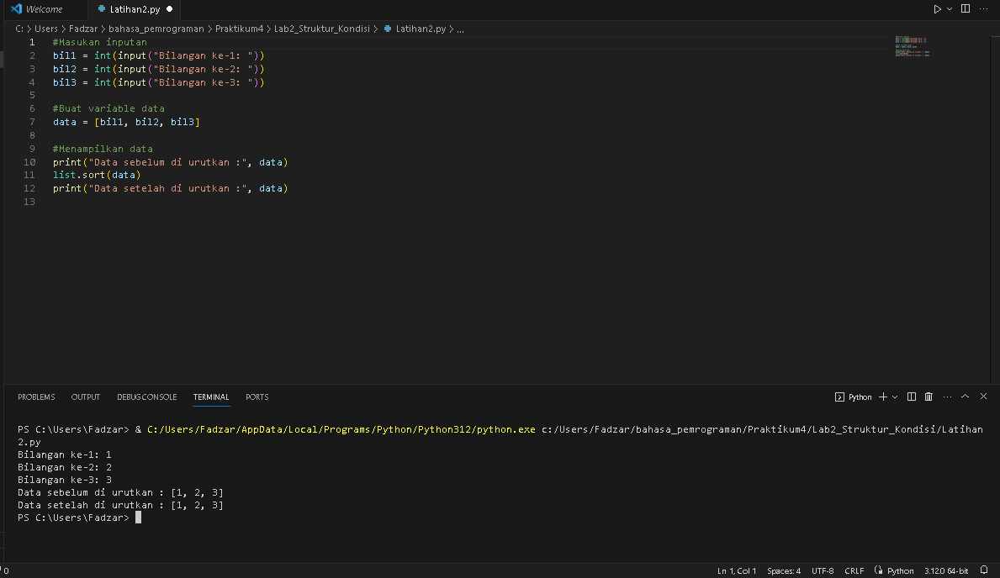

# Praktikum4
## Struktur Kondisi
## PROFIL
| Variable | Isi |
| -------- | --- |
| **Nama** | Fadzar Surya Wijaya |
| **NIM** | 312310451 |
| **Kelas** | TI.23.A.5 |
| **Mata Kuliah** | Bahasa Pemrograman |

## Tugas struktur kondisi 
### Latihan 1
* Pada Latihan 1, kita membuat program sederhana dengan input 2 buah bilangan, kemudian
tentukan bilangan terbesar dari kedua bilangan tersebut
menggunakan statement if.

1. Kode ini menggunakan input(), kode meminta pengguna untuk memasukkan dua bilangan bulat.
2. Kode kemudian membandingkan kedua bilangan menggunakan pernyataan if. Jika bilangan1 lebih besar dari bilangan2, maka bilangan_terbesar diatur menjadi bilangan1, jika tidak, maka diatur menjadi bilangan2.
Terakhir, kode mencetak bilangan terbesar ke konsole / terminal.
3. Hasil akhirnya adalah kode ini akan menampilkan bilangan terbesar dari dua bilangan yang dimasukkan oleh pengguna.
#### Hasil program
- ```Lab2 Struktur kondisi (Latihan1)```


### Latihan 2
* Lalu pada latihan 2, kita membuat program untuk mengurutkan data berdasarkan input sejumlah
data (minimal 3 variable input atau lebih), kemudian tampilkan
hasilnya secara berurutan mulai dari data terkecil.

1. Program ini meminta pengguna memasukkan jumlah data, kemudian pengguna memasukkan data tersebut. Setelah mengumpulkan semua data, program mengurutkan data dari yang terkecil hingga yang terbesar.
2. Hasil akhirnya adalah kode ini akan menerima input dari pengguna, mengurutkan data yang dimasukkan, dan kemudian mencetak hasil pengurutan tanpa desimal.

#### Hasil program
```Lab2 Struktur kondisi (Latihan2)```



## Tugas perulangan
### Latihan 1
* Pada latihan 1, kita membuat program dengan perulangan bertingkat (nested) for yang
menghasilkan output sebagai berikut:
<ol type="1" style="line-height:80%"><li>Kode ini mencetak pola tabel 10x10 dengan angka yang dihasilkan dari penjumlahan variabel i dan j dalam loop. Setiap baris mencetak hasil penjumlahan i + j, dengan angka-angka tersebut dipisahkan oleh tab ("\t"), dan kemudian mencetak baris baru untuk mengawali baris baru.</li></ol>

#### Hasil program
- ```Lab3 Perulangan (Latihan1)```


### Latihan 2
<ul type="list-style-type:disc"><li>Pada latihan 2, kita membuat program<br></li>
  ```Tampilkan n bilangan acak yang lebih kecil dari 0.5.```<br>
  ```nilai n diisi pada saat runtime```<br>
  ```anda bisa menggunakan kombinasi while dan for untuk menyelesaikannya```

<ol type="1"><li>Kode tersebut meminta pengguna memasukkan jumlah n. Jika n lebih besar dari 0, maka kode akan menghasilkan dan mencetak n bilangan acak yang kurang dari 0.5. Jika n tidak lebih besar dari 0, maka kode akan memberi pesan bahwa n harus lebih besar dari 0.</li>
<li> Hasil akhirnya adalah kode ini akan mencetak bilangan acak yang kurang dari 0.5 sebanyak n kali sesuai dengan jumlah yang dimasukkan oleh pengguna.</li>

#### Hasil program
- ```Lab3 Perulangan (Latihan2)```


## Tugas Labspy_02
### Praktikum 2
<ul type="list-style-type:disc"><li>Buat program sederhana dengan input tiga buah bilangan, dari ketiga bilangan
tersebut tampilkan bilangan terbesarnya. Gunakan statement if.</li>
<ol type="1"><li>Program akan meminta pengguna untuk memasukkan tiga bilangan: bilangan1, bilangan2, dan bilangan3.</li>
<li>Tentukan sebuah variabel bernama "bilangan_terbesar" untuk menyimpan bilangan terbesar.</li>
<li>Gunakan pernyataan if dan elif untuk memeriksa kondisi berikut:<br>
Jika bilangan1 lebih besar dari bilangan2 dan bilangan1 lebih besar dari bilangan3, maka bilangan1 adalah bilangan terbesar.<br>
Jika bilangan2 lebih besar dari bilangan1 dan bilangan2 lebih besar dari bilangan3, maka bilangan2 adalah bilangan terbesar.<br>
Jika kedua kondisi di atas tidak terpenuhi, maka bilangan terbesar adalah bilangan3.</li></ol>
<li>program akan mencetak bilangan terbesar ke terminal / konsole.</li></ol>

#### Hasil program
- ``` Praktikum2 (modul 2)(lab2py)```


### Flowchart
- ``` FLowchart (screenshot_1)```


- ``` FLowchart (screeensshot_2)```


## Tugas Labpy03
### Latihan 1
#### Hasil Program
- ``` Latihan1 (modul 3)(lab3py)```


### Latihan 2
#### Hasil Program
- ``` Latihan2 (modul 3)(lab3py)```


### Tugas Program1.py
*Buat program sederhana dengan perulangan: program1.py
Seorang pengusaha menginvestasikan uangnya untuk memulai usahanya dengan
modal awal 100 juta, pada bulan pertama dan kedua belum mendapatkan laba. pada
bulan ketiga baru mulai mendapatkan laba sebesar 1% dan pada bulan ke 5,
pendapatan meningkat 5%, selanjutnya pada bulan ke 8 mengalami penurunan
keuntungan sebesar 2%, sehingga laba menjadi 3%. Hitung total keuntungan selama 8
bulan berjalan usahanya.*

#### Hasil Program
- ``` Program1 (modul 3)(lab3py)```


## Langkah-langkah pengerjaan latihan

1. Konfigurasi terlebih dahulu username dan email pada global repository-nya

```
git config --global user.name “nama_user”
```

```
git config --global user.email “email_user”
```

2. Buat repository local

```
mkdir bahasa_pemrograman
```

```
cd bahasa_pemrograman
```

```
mkdir lab2py
```

3. Jika sudah, jalankan command (command git init digunakan untuk menginisialisasi repositori git baru)

```
git init
```

## Menambahkan File Baru Pada Repository Lokal

1. Untuk membuat file baru bisa juga dengan text editor

disini akan menggunakan terminal

```
echo “# lab2py” >> README.md
```

2. Untuk menambahkan file yang baru saja dibuat, gunakan command

```
git add README.md
```

3. Untuk menyimpan perubahan yang ada pada database repositori
   lokal, gunakan command

```
git commit -m "first commit"
```

## Membuat Repository Server

1. Server repository yang digunakan adalah github
2. Buat akun github terlebih dahulu
3. Klik tombol + new repository
4. Isi nama repository-nya,

```
   contoh: lab2py
```

5. lalu klik tombol Create repository

## Menambahkan Remote Repository

- Remote Repository merupakan server repositori yang akan digunakan untuk menyimpan segala perubahan yang dilakukan pada repositori lokal, dan bisa diakses oleh banyak pengguna
- Untuk menambahkan remote repository server, gunakan command

```
git remote add origin [url]
```

## Mengirim perubahan ke server (Push)

- Untuk mengirim perubahan pada repositori lokal ke server, gunakan command

```
git push -u origin master
```

## Clone Repository


- git clone digunakan untuk mengambil salinan dari repositori Git dari server ke repositori lokal
- gunakan command ini untuk melakukan kloning ke repositori lokal

```
git clone [url]
```